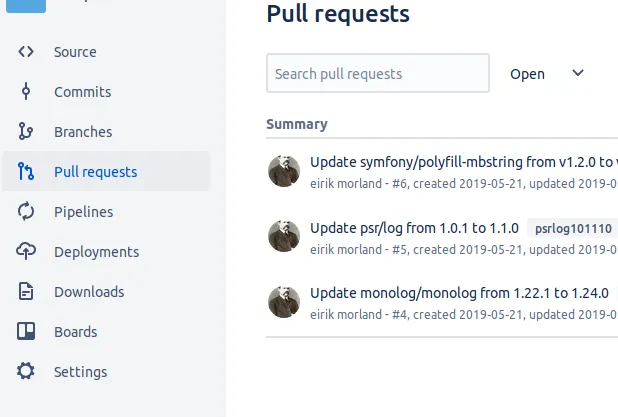
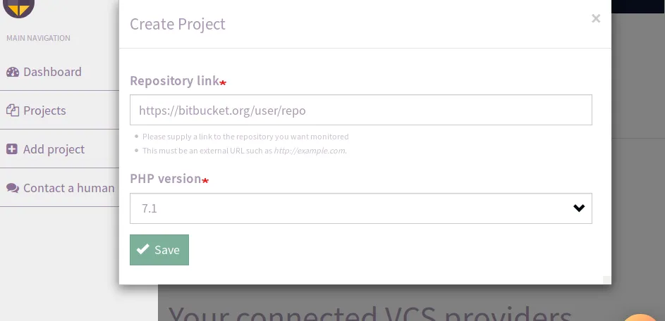

After a period of private testing, we are now very glad to say we consider our brand new Bitbucket integration stable!

Automatically created pull requests from Violinist.io
If you are already using violinist.io with other version control providers, the image above probably looks familiar to what you are used to. If you are not familiar with the service, here is a very brief explanation:

## 1. Create an account on violinist.io
This can be done by clicking on the login link from the front page, an exercise most readers would be comfortable with.

## 2. Create a project on violinist.io
After logging in, simply add your Bitbucket repo as a project on violinist.io

## 3. Enjoy updates to your dependencies!
The rest is fully automated! You will start getting pull requests, and they will look something like this:

Remember you can always customize parts of your configuration for [https://violinist.io](https://violinist.io), for which you will find documentation at [https://docs.violinist.io](https://docs.violinist.io).

Happy updating!

https://violinist.io
