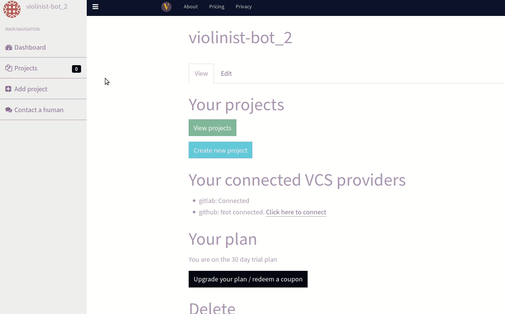

Today marks a huge milestone for violinist.io. After a successful round of private beta testing, we are finally announcing full support for Gitlab as hosting provider on the Violinist platform.

As supporters and evangelists of open source it is with a certain amount of pride we can say we finally also support a platform that is itself open source. Even though we acknowledge the role of Github in the open source ecosystem, it feels good to provide open source alternatives.

With just a few clicks, you can start keeping your dependencies up to date automatically.

For users using Github as a provider, your repositories will continue being monitored.

For those wanting to start keeping their Gitlab repos up to date, this means you can finally sign up directly and start updating your dependencies automatically.

And if you are using both of them, you can just as easily connect both accounts into one Violinist.io account.

## Self-hosted Gitlab
If this excites you, but you have a self hosted version of Gitlab for you repos, you are in luck. Support is already in place, and private beta testing is already underway. If this is of interest, please be in touch.

Finally, thanks to those who have beta-tested the new features, and we hope that bringing in Gitlab as a platform will inspire even more people to automate their dependency updates!

If you have not signed up yet, you can sign up for free here. Public repos will always be free, and the free plan gives you one private repo for free.

Happy updating!